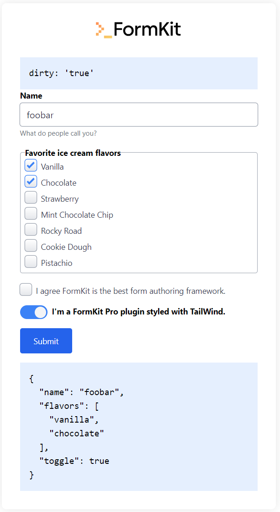

# FormKit + TailWind


## Import styles from package

Classes are imported from https://github.com/formkit/formkit/blob/master/packages/themes/src/tailwindcss/genesis/index.ts.

```js
## formkit.config.ts
import tailwindcssGenesis from '@formkit/themes/tailwindcss/genesis'
const config: DefaultConfigOptions = {
  classes: generateClasses(tailwindcssGenesis),
  ...
}
export default config
```

## Let TailWind scan FromKit classes
```js
## tailwind.config.ts
const formkit = "./node_modules/@formkit/themes/dist/tailwindcss/genesis/**/*.mjs"
// would also work:
// import FormKitTailWindGenesis from '@formkit/themes/tailwindcss/genesis'
// const formkit = { raw: JSON.stringify(FormKitTailWindGenesis), extension: "js" }
export default {
  content: [
    formkit,
    ...
  ],
}

```

## Screenshot

